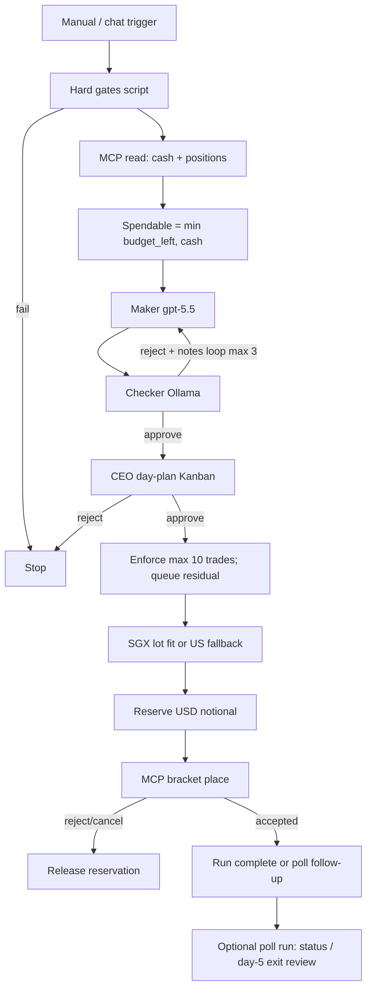
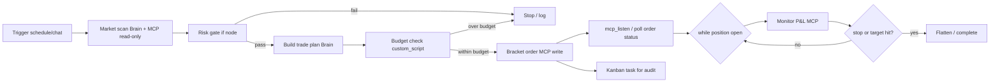

# IBKR Trading Workflow

Plan for connecting Interactive Brokers (IBKR) to Agent OS via MCP, and building an agentic workflow that can place orders, stay within budget, and enforce stop-loss / take-profit rules.

**Disclaimer:** All community IBKR MCP servers are unofficial and not endorsed by Interactive Brokers. This document describes automation tooling — not financial advice. Use paper trading until the workflow is validated. Live trading may require compliance review depending on jurisdiction.

---

## 0. Locked product decisions (maker / checker paper workflow)

Agreed scope for the first build. Hard gates are enforced in **custom_script** (and MCP write guards), not by LLM trust.

### Markets & allowlist (workflow variables — no code / .env)

Tradable instruments and trading policy are **workflow Variables** on the day-plan / poller definitions:

| Variable | Purpose |
|---|---|
| `allowlist` | Array of instruments: `key`, `symbol`, `exchange`, `market`, `currency`, `board_lot`, `sec_type` |
| `allowlist_keys` | Derived keys (prompt convenience) |
| `markets` | Labels for the maker |
| `daily_budget_usd`, `max_trades_per_day`, `stop_pct_*`, `tp_pct_*`, `entry_slip_pct_max`, `max_hold_days`, … | Policy |

Seed scripts write an initial example universe into the definition once (`backend/scripts/ibkr-seed-variables.js`). After that, change tickers only in the Variables UI (or API) — not in code or `.env`.

Gateway connection secrets stay in `.env`: `IBKR_HOST`, `IBKR_PORT`, `IBKR_CLIENT_ID`, `IBKR_ACCOUNT_ID`, `IBKR_IS_PAPER`, `IBKR_TRADING_ENABLED`.

### Capital & budget

| Rule | Value |
|---|---|
| Daily budget | **1000 USD** (SGD notionals converted to USD for the ledger) |
| Spendable | `min(daily_budget_remaining, IBKR cash)` — **cash only, no margin/credit** |
| Deposit | **Manual by user** — workflow never funds the account |
| Reservation | On **place**, reserve full notional until **reject/cancel**; then release. Fills keep reservation consumed |
| Trades/day | Max **10** placements (**buy + sell**). Extra ideas → **residual queue for next day** |

### Maker / checker / CEO

| Role | Model (Brain **node** `taskConfig`) | Behavior |
|---|---|---|
| **Maker** | `modelSource=openai`, `model=gpt-5.5`, `apiKey` on node | Day plan + per-trade JSON with rationale (1–3m trend, entry, SL%, TP%) |
| **Checker** | `modelSource=ollama`, `model=llama3.2` (or `OLLAMA_MODEL`), no API key | Approve / reject + **adjustment recommendations** → loop back to maker |
| Checker loop | Max **3** rounds (`while` + parse); then fail the day plan |
| **CEO** | Kanban `ceo_approval` | Approve **day plan once** at start of day (manual/chat trigger) |

**Models live on Brain nodes**, not platform `.env` for OpenAI keys. Checker uses **local Ollama** (OpenAI-compatible `/v1` on `11434`) — no Anthropic key required for this trial workflow.

Maker still needs OpenAI `apiKey` on the Brain node.

### Order rules (side + bracket)

- **Side** (`BUY` or `SELL_TO_CLOSE`) is decided by **maker** (within rules), validated by script — **not** invented by IBKR.
- IBKR receives a **full bracket**: entry + stop + take-profit children.
- Entry: maker-set; may be up to **+0.25%** above reference; downside discretionary with rationale.
- Stop loss: **1.5%–2%**, maker-justified, script-clamped.
- Take profit: **0.5%–2%**, maker-justified, script-clamped.
- Hold up to **5 days** before exit-review sell-to-close is allowed (mode **B**).
- **No shorting.** Sell only to close existing longs.

### Trigger & poll

- **Phase 1:** manual / chat trigger only (`run ibkr day plan`).
- **Poll:** same workflow family as a **follow-up run / in-graph stage** (MCP order/position status) — not a separate OS process, not always-on tick SSE in v1.
- **Schedule / continuous poll:** next phase.
- **Buy/sell:** maker decides `BUY` | `SELL_TO_CLOSE`; script validates; IBKR gets full **bracket** (entry + SL + TP), not SL/TP alone.

### MCP / paper

- **Paper** = IBKR simulated account (fake money), Gateway port **7497**.
- Start with community MCP (**code-rabi/interactive-brokers-mcp**) on paper; evolve to hybrid read/write MCP with gated write tools.
- Kill switch: `IBKR_TRADING_ENABLED=0` until ready (dry-run place still records reservations for testing).
- **Workflow variables** (static per workflow): `allowlist_keys`, `markets`, `max_hold_days` (default **5**), `checker_max_loops`, etc. Readable as `{{var.key}}` in Brain prompts / bindings.
- **Day plan** (`ibkr-maker-checker-paper`): snapshot cash+positions+pending sells → maker (subset of allowlist, rich justification) ↔ checker → CEO → place.
- **Poller** (`ibkr-position-poller-paper`, **new**): schedule `*/15 * * * *` → snapshot → aged positions ≥ `max_hold_days` → maker/checker **SELL|HOLD** → record holds / place sells. No CEO each tick.

### Implementation map (Agent OS)

| Piece | Location |
|---|---|
| Rules / clamps | `backend/src/services/ibkr-trading-rules.js` |
| Variable helpers | `backend/src/services/ibkr-workflow-variables.js` |
| Seed initial variables | `backend/scripts/ibkr-seed-variables.js` (written into definition once) |
| Budget ledger (USD) | `backend/src/services/ibkr-trading-ledger.js` + SQLite tables |
| HTTP API | `backend/src/routes/ibkr-trading.js` → `/api/ibkr-trading/*` |
| Seed workflow | `backend/scripts/seed-ibkr-maker-checker-workflow.js` |
| Paper MCP setup | `backend/scripts/setup-ibkr-paper-mcp.md` (steps) + register via Integrations |

### Day flow (locked)



---

## 1. IBKR connectivity (underneath any MCP)

Every path requires a **live IB session**. There is no fully headless IBKR API.

| Layer | How it connects | Best for |
|---|---|---|
| **TWS API** (socket) | Python/Java via `ib_insync` / official libs → **TWS** or **IB Gateway** (ports 7497 paper / 7496 live) | Real-time quotes, bracket orders, stop/limit, algos |
| **Client Portal Web API** (REST) | **Client Portal Gateway** (local Java) → HTTPS to IB | Simpler HTTP integration; account/orders; session tickle required |
| **IBKR FIX** | Institutional | Overkill for agent workflows |

MCP servers sit **on top** of one of these — they do not replace TWS/Gateway.

### Prerequisite setup (all options)

1. IBKR account with **paper trading** enabled for development.
2. **IB Gateway** or **TWS** running locally (Gateway preferred — lower resource use).
3. API enabled: File → Global Configuration → API → Settings:
   - Enable "ActiveX and Socket Clients"
   - Socket port: **7497** (paper) or **7496** (live)
   - Add **127.0.0.1** to Trusted IPs
4. Only one active IB session per username — log out of Client Portal / mobile if Gateway fails to connect.

---

## 2. MCP options for IBKR

### Option A — Community MCP (fastest start)

| Server | Activity | API backend | Trading | Notes |
|---|---|---|---|---|
| [code-rabi/interactive-brokers-mcp](https://github.com/code-rabi/interactive-brokers-mcp) | ~196★, active (v1.24+) | TWS API | **Yes** — market/limit/stop, read-only toggle | `npx` setup, bundles Gateway; **alpha**, unofficial |
| [rcontesti/IB_MCP](https://github.com/rcontesti/IB_MCP) | ~128★ | **Web API** (Client Portal Gateway) | Via REST routers | Docker compose, FastMCP; good if you prefer REST |
| [ArjunDivecha/ibkr-mcp-server](https://github.com/ArjunDivecha/ibkr-mcp-server) | ~32★ | TWS API | **Yes** + short/margin analysis | **Archived** — reference only |
| [jinyiabc/ibkr-mcp](https://github.com/jinyiabc/ibkr-mcp) | Small | TWS API | Basic orders | Windows-focused, minimal |
| [osauer.dev ibkr MCP](https://osauer.dev/ibkr/ibkr-mcp/) | Go binary | TWS/Gateway | **Read-only** — no order tools | Portfolio/risk/sizing analysis only |

**For order placement (paper):** start with **code-rabi/interactive-brokers-mcp** on port **7497**, register in Agent OS MCP registry, probe until `healthy`.

**For analysis-only first:** osauer **ibkr** MCP or code-rabi with **read-only mode on** — agent plans trades but cannot execute.

### Option B — Custom Agent OS MCP (production-grade)

Build `mcp-servers/ibkr-trading-mcp/` (or similar) wrapping **ib_insync** (Python) or the Web API.

**Tools to expose** — narrow surface; do not expose raw `place_order` to the LLM:

| Tool | Purpose |
|---|---|
| `get_account_summary` | Cash, buying power, net liquidation |
| `get_positions` | Open positions + unrealized P&L |
| `get_quote` | Bid/ask/last for symbol |
| `evaluate_trade_plan` | Validate qty × price ≤ budget, check existing exposure |
| `submit_bracket_order` | Entry + stop-loss + take-profit as **one atomic IB bracket** |
| `get_order_status` | Fill status |
| `cancel_order` / `flatten_position` | Emergency exit |
| `get_daily_pnl` | Day P&L vs budget cap |

The LLM calls **high-level intent tools**, not raw order parameters — reduces hallucinated trades.

Wire into Agent OS via existing `POST /integrations/mcp` → `mcp_servers` table → workflow `mcp_tool` / brain `mcpToolCalling` nodes (same pattern as the Brain+MCP recipe in `agent-workflow-recipes.js`).

### Option C — Hybrid (recommended architecture)

Split **analysis MCP** (read-only) and **execution MCP** (write, heavily gated):

```
Analysis MCP (read-only)          Execution MCP (write, localhost only)
  get_positions                     submit_bracket_order
  get_quotes                        cancel_all_orders
  portfolio_risk                    flatten_position
```

Brain/agent uses analysis freely; execution MCP is reachable only from workflow nodes after deterministic checks pass.

### Option comparison

| If you want… | Choose |
|---|---|
| Fastest proof-of-concept on paper | **code-rabi/interactive-brokers-mcp** + Brain+MCP workflow |
| Safest first iteration (no accidental orders) | **osauer ibkr MCP** (read-only) + custom execution script you control |
| REST-native, Docker-friendly | **rcontesti/IB_MCP** + Client Portal Gateway |
| Production control over tools and guardrails | **Custom MCP** with `submit_bracket_order` + Agent OS `custom_script` risk gate |
| Full autonomous live trading | **Not recommended** without CEO approval node + hard budget circuit breakers + months of paper validation |

---

## 3. Agentic workflow design (Agent OS)

Agent OS primitives: **brain** (LLM + MCP tool loop), **mcp_tool**, **if**, **while**, **ceo_approval**, **Kanban**, **mcp_listen** (SSE).

### Workflow graph



### Where each concern lives

| Concern | Implementation | Why not LLM-only |
|---|---|---|
| **Budget** | `custom_script` or `api` node: `max_notional`, `max_daily_loss`, `max_open_positions` from env/DB; hard reject before MCP write | LLMs miscount size and ignore caps |
| **Stop loss** | IB **bracket order** at submission (stop child order) — not agent-decided mid-trade | Deterministic, exchange-side |
| **Take profit** | IB bracket **limit** child at target % or ATR | Same |
| **When to stop trading** | `if` node on `daily_pnl <= -max_daily_loss` OR `consecutive_losses >= N` | Circuit breaker |
| **When to book profit** | Trailing stop via IB algo order, or `while` loop monitoring unrealized P&L with **fixed rules** (e.g. close at +2R) | Agent can *suggest* adjustment; rule engine decides |
| **Human override** | `ceo_approval` before first live order; Kanban card with plan summary | Required for live accounts |

Combine patterns from `brain-mcp-loop` and `brain + CEO approval` recipes in `backend/src/services/agent-workflow-recipes.js` — **plan → approve → execute**.

**Rule:** stop/target prices are computed by **script nodes**, submitted as **bracket orders** — the agent never sends a naked market order without an attached stop.

---

## 4. Stop-loss / take-profit strategies

Pick one strategy and enforce it in code (not in LLM prompts alone).

| Strategy | Mechanism | Agent role |
|---|---|---|
| **Fixed bracket** | Entry + stop % + target % at order time | Agent picks symbol + direction; script sets % |
| **ATR-based** | Stop = 1.5× ATR, target = 2× ATR | Brain computes ATR from historical MCP data; script validates |
| **Time stop** | `while` loop: if position age > N hours and P&L flat → exit | Rule in workflow, not LLM |
| **Daily loss limit** | If `daily_pnl < -X` → cancel all + halt workflow | Circuit breaker `if` node |
| **Trailing stop** | IB trailing stop order type | MCP tool wraps IB native trailing |

---

## 5. Wiring into Agent OS

1. **Run IB Gateway** (paper) on host or Docker sidecar; enable API socket, trusted IP `127.0.0.1`.
2. **Deploy IBKR MCP** (Option A, B, or C) on localhost; stdio or SSE transport matching `backend/src/services/mcp-client.js`.
3. **Register** via Integrations → MCP (`mcp_servers`); run health probe until tools cache populates.
4. **Create workflow** with nodes:
   - `brain` + `mcpToolCalling` → analysis MCP (quotes, positions)
   - `custom_script` → budget/risk validation (deterministic JS)
   - `if` → branch on validation result
   - `mcp_tool` → `submit_bracket_order` (execution MCP only)
   - `while` + `mcp_tool` → poll position until flat or timeout
   - `ceo_approval` → Kanban gate for live trading
5. **Log everything** to `mcp_call_logs`; optionally mirror to knowledge graph per `knowledgeGraph.md`.
6. **Paper trade 30+ days** before disabling read-only / CEO gate on live.

### Minimal viable workflow (first iteration)

1. **Read-only scan** — Brain calls MCP: positions, quotes, account summary.
2. **Brain outputs trade plan JSON** — symbol, side, qty, stop %, target %, rationale.
3. **Custom script validates** — budget, max position size, no duplicate symbol, market hours.
4. **CEO Kanban approval** — human confirms plan.
5. **MCP bracket order** — single atomic submission.
6. **While loop monitors** — poll until filled/closed; log to Kanban + MCP logs.

---

## 6. Environment variables (Gateway connection only)

Trading policy (allowlist, budget, stops, hold days, checker loops) is **not** in `.env` — set it on the workflow Variables panel.

```env
# IB Gateway / TWS (paper first)
IBKR_HOST=127.0.0.1
IBKR_PORT=4002                    # Gateway paper often 4002; TWS paper 7497
IBKR_CLIENT_ID=17
IBKR_ACCOUNT_ID=                  # optional; else first managed account
IBKR_IS_PAPER=true
IBKR_TRADING_ENABLED=0            # kill switch — 0 = ledger dry-run only
IBKR_ALLOW_LIVE=0                 # must be 1 to place if IBKR_IS_PAPER=false
```

See `backend/.env.example`.

### Order events + reconcile (30-day learnings)

- Table `ibkr_order_events` stores place/cancel/fill/reconcile events (`status`, `reason_code`, `reason_text`, `source`, IB order id).
- Retention: **30 days** (pruned on write).
- Each `POST /account-snapshot` **reconciles** `reserved` ledger rows vs live open orders/positions and attaches `order_learnings` for the Maker.
- Workflow cancels use standard reasons: `workflow_dayplan_cancel`, `workflow_poller_cancel`, `workflow_cancel_before_sell`, `workflow_e2e_cancel_all`.
- APIs: `GET|POST /api/ibkr-trading/order-events`, `GET|POST /api/ibkr-trading/order-learnings`
  - `days` (e.g. 3 / 7 / 30, max retention 30), optional `symbol_key`, `limit`
  - `response_type`: `actual` (events + heuristic learnings + `context_text`) | `summarized` (platform LLM → `context_text` / `bodyText`)

### Brain history (maker/checker audit → Maker context)

- Platform API: `POST|GET /api/agent-workflows/brain-history`
- Body: `workflow_id[]`, `node_id[]`, `days` (e.g. 7/30), `response_type`: `actual` | `summarized`, optional `limit`
- `actual` returns Brain step I/O from `agent_workflow_run_steps`; `summarized` uses platform LLM (`.env` OPENAI_*) to compress into `context_text` for prompts
- Day-plan / poller call this with `response_type=summarized` before the maker loop and inject `{{api-brain-history.body.context_text}}` into Maker user message
- Variable: `brain_history_days` (default 7)

### Order history in workflows

- Day-plan / poller call `POST /api/ibkr-trading/order-learnings` with `response_type=summarized` after brain-history
- Inject `{{api-order-history.body.context_text}}` into Maker and Checker user messages
- Variable: `order_history_days` (default 7)

### Portfolio analytics (fills / PnL / cash)

- Durable tables: `ibkr_fills`, `ibkr_position_snapshots`, `ibkr_realized_pnl`, `ibkr_cash_events`
- Snapshot persist + fill confirm wired from place watch / reconcile / `confirmFill`
- Entitled APIs (session owner only):  
  `GET|POST /api/ibkr-trading/analytics/summary`,  
  `GET .../fills`, `/positions`, `/pnl`, `/cash-events`
- Content tools for agents: `ibkr_portfolio_analytics`, `ibkr_fills_history`, `ibkr_pnl`, `ibkr_cash_events`

---

## 7. Security and compliance

- Never expose execution MCP to the public internet; bind **127.0.0.1** only.
- Use **paper account** until workflow + knowledge graph show stable behavior.
- Store credentials in env / `auth_secret_env` on MCP server rows — not in workflow graphs.
- **`IBKR_TRADING_ENABLED=0`** kill switch checked in every write tool.
- Community MCP servers are **alpha** — review source, pin version, run read-only first.
- Log all order attempts to `mcp_call_logs` and Kanban for audit trail.
- Live trading may require compliance review depending on jurisdiction.

---

## 8. File map (when implementing)

| New | Modify |
|---|---|
| `backend/src/services/ibkr-trading-rules.js` | `backend/.env.example` |
| `backend/src/services/ibkr-trading-ledger.js` | `backend/src/db/schema.js` (ledger tables) |
| `backend/src/routes/ibkr-trading.js` | `backend/src/index.js` |
| `backend/scripts/seed-ibkr-maker-checker-workflow.js` | `backend/src/services/custom-scripts.js` (pass through `decision`) |
| `backend/scripts/samples/ibkr-parse-checker.js` | |
| `backend/scripts/setup-ibkr-paper-mcp.md` | |

Seeded workflow id: `ibkr-maker-checker-paper` · chat: `run ibkr day plan`

---

## 9. Success criteria

- MCP server registers as `healthy` in Agent OS with expected tools cached.
- Paper workflow completes: scan → plan → validate → approve → bracket order → monitor → close.
- Budget script rejects over-limit trades without calling execution MCP.
- Daily loss circuit breaker halts workflow when threshold hit.
- All MCP invocations appear in `mcp_call_logs` with redacted auth.
- 30+ days paper trading with CEO approval before live `IBKR_TRADING_ENABLED=1`.

---

## Related codebase references

| Area | Key files |
|---|---|
| MCP registry & invoke | `backend/src/services/mcp-servers.js`, `mcp-client.js` |
| Workflow Brain + MCP | `backend/src/services/agent-workflow-brain.js`, `agent-workflow-recipes.js` |
| MCP tool node | `backend/src/services/agent-workflow-task-catalog.js` (`mcp_tool`) |
| CEO approval / Kanban | `backend/src/services/agent-workflow-kanban.js`, `routes/kanban.js` |
| Custom script validation | `backend/src/services/custom-script-scanner.js`, custom_script workflow node |
| MCP call logging | `mcp_call_logs` table in `backend/src/db/schema.js` |
| Agent intelligence / feedback | `knowledgebase/knowledgeGraph.md` |

---

## External links

- [IBKR API overview](https://www.interactivebrokers.com/campus/ibkr-api-page/getting-started/)
- [TWS API docs](https://www.interactivebrokers.com/campus/ibkr-api-page/twsapi-doc/)
- [Client Portal Web API](https://www.interactivebrokers.com/campus/ibkr-api-page/cpapi-v1/)
- [code-rabi/interactive-brokers-mcp](https://github.com/code-rabi/interactive-brokers-mcp)
- [rcontesti/IB_MCP](https://github.com/rcontesti/IB_MCP)
- [osauer ibkr MCP (read-only)](https://osauer.dev/ibkr/ibkr-mcp/)
